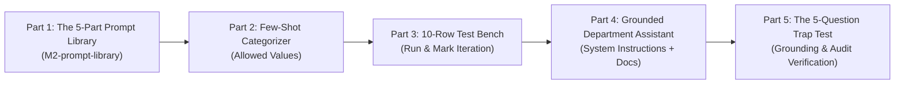

# 🛠️ Hands-On Lab: Prompting for Operators
### **AI Administrator: Agentic Workflows & Automation · Day 1 · Session 2**

[](https://www.computer.org/)
[](https://www.computer.org/membership/chapters)
[](https://aicaravan.org)
[](https://ieeer8.org/)
[](https://aistudio.google.com/)

<p align="center">
  <b>Curriculum Author:</b> Dr. Abedal-Kareem Al-Banna (University of Petra)<br>
  <b>Lead Instructor:</b> Robina Mirbahar (Google Developer Expert in Machine Learning)<br>
  <b>Duration:</b> 120 Minutes · <b>Environment:</b> Google AI Studio (Web UI — Zero Coding Required)
</p>

---

</div>

## 📌 Executive Summary & Session Objectives

In this hands-on lab, you will transition from a casual AI user to a **systems administrator** who writes prompts as deterministic, machine-readable work instructions. Using the web interface of **Google AI Studio**, you will engineer reusable templates, build a high-precision classification test bench, and deploy an un-hallucinating Department Policy Assistant.

### 🎯 What you will be able to do:
- **Implement the 5-Part Prompt Architecture:** Role, Context, Task, Constraints, and Output Format.
- **Enforce Structured Outputs:** Constrain outputs to labeled fields and allowed categorical values ready for automation pipelines (e.g., n8n, spreadsheets).
- **Construct a 10-Row Evaluation Test Set:** Benchmark and measure prompt repeatability using a systematic score sheet.
- **Deploy a Grounded Document Assistant:** Utilize Google AI Studio's System Instructions and Document Uploads to anchor responses in verified policy text.
- **Execute a 5-Question Trap Test:** Audit assistant safety by forcing refusal responses on ungrounded/out-of-scope queries.

---

## 🗺️ Lab Architecture & Workflow



---

## 🚀 Environment Setup: Google AI Studio

1. Open **[Google AI Studio](https://aistudio.google.com/)** in your browser.
2. Sign in with your Google account.
3. Click **Create New Prompt** ➔ Select **Freeform Prompt** (or **Chat Prompt**).
4. In the right-hand settings panel:
   - **Model:** `Gemini 1.5 Flash` (optimized for fast, operational throughput).
   - **Temperature:** Set to `0.2` (low temperature eliminates creative randomness and enforces deterministic formatting).
   - **Top P:** `0.95`.

<p align="center">
  
  <br><br>
  
  <br>
  <em>Figure 1: Configuring Gemini 1.5 Flash with Temperature = 0.2 in Google AI Studio.</em>
</p>

---

## 📂 Part 1: Build the 5-Part Prompt Library (`M2-prompt-library`)
*(Slide Reference: Slides 8–13, 44, 47)*

Create a local document named `M2-prompt-library`. For each of the five operations below, build a reusable template using square-bracket `[placeholders]` following the universal skeleton:

```text
Role: You are an assistant to the [role] in [department].
Context: [two or three facts and definitions the model must know]
Task: [one verb, one deliverable]
Constraints: Use only the information provided. If something is unclear or missing, write "unclear". Maximum [N] words. Tone: [plain / formal].
Output format (exactly these lines):
[Field 1]:
[Field 2]:
[Field 3]:

Input: [paste text]
```

### 1.1 Template 1: Triage an Email
```text
Role: You are an assistant to the facilities coordinator of a 200-person office.
Context: We receive maintenance requests by email. Urgent means a safety risk or a stopped service (lift, water, power, access).
Task: Read the email below and produce a triage note.
Constraints: Do not invent details that are not in the email. If the urgency is unclear, say "unclear" rather than guessing. Maximum 80 words. Tone: plain.
Output format (exactly these labelled lines):
Requester:
Location:
Issue (one sentence):
Urgency (urgent / normal / unclear):
Suggested next action:

Email: [paste email here]
```

### 1.2 Template 2: Summarise a Meeting Transcript
```text
Role: You are an administrative assistant supporting a project management office.
Context: Project managers require concise action registries immediately following sprint reviews.
Task: Extract actionable tasks and decisions from the transcript below.
Constraints: Do not summarize discussions that did not result in an assigned action or agreed decision. If an owner is not mentioned for a task, write "Unassigned". Maximum 120 words.
Output format (exactly these lines):
Decisions Made:
- [Decision 1]
Action Items:
- [Task description] | Owner: [Name/Unassigned] | Deadline: [Date/Unspecified]

Transcript: [paste transcript here]
```

### 1.3 Template 3: Draft an Acknowledgment Reply
```text
Role: You are a customer communications coordinator for an enterprise IT provider.
Context: Clients write to report service interruptions. Our policy is to acknowledge receipt within 15 minutes without accepting legal liability or promising unconfirmed fix times.
Task: Draft a formal acknowledgment reply to the client message below.
Constraints: Do not commit to a specific resolution hour. Direct urgent escalations to the 24/7 hotline at +1-800-555-0199. Maximum 90 words. Tone: professional and calm.
Output format:
Subject: [Drafted Subject Line]
Body: [Drafted Message Body]

Client Message: [paste client message here]
```

### 1.4 Template 4: Extract Fields from a Form
```text
Role: You are an enterprise data entry auditor.
Context: Vendors submit unstructured registration requests. We require specific fields to register them in our enterprise ERP.
Task: Extract vendor onboarding data from the text below.
Constraints: Output only the specified labels. If a value is missing, write "MISSING". Do not guess VAT/Tax IDs.
Output format (exactly these labelled lines):
Company Legal Name:
Tax/VAT Number:
Primary Contact Email:
Country of Registration:
Payment Terms Requested:

Vendor Text: [paste raw text here]
```

### 1.5 Template 5: Classify a Request
*(See Part 2 below).*

---

## 🏷️ Part 2: Few-Shot Categorizer with Allowed Values
*(Slide Reference: Slides 16–18, 44)*

> **The Operational Principle:** Automations cannot parse prose; they read fields. Saying allowed values out loud stops the model from inventing unexpected categories on Tuesday!

### Step-by-Step Instructions:

1. **Open a Freeform Prompt** in Google AI Studio.
2. In the **System Instructions** panel at the top, enter:
   ```text
   You are an automated support ticket triage classifier.
   ```
   <p align="center">
  
  <br>
  <em>Figure 2: Running the few-shot ticket classifier in Google AI Studio.</em>
</p>

   
3. In the main prompt box, paste this few-shot prompt:
   ```text
   Classify each message as billing, technical, sales or other.

   Example 1: "My invoice shows the old price" -> billing
   Example 2: "The portal logs me out every minute" -> technical
   Example 3: "Do you offer a plan for schools?" -> sales
   Example 4: "Thanks for the quick help yesterday" -> other
   Example 5: "Can you send someone to inspect our office garden?" -> other

   Now classify: "[message]"
   Answer with the category only.
   ```
4. **How to test your first input:**
   Replace the placeholder `[message]` with a real ticket:
   ```text
   Now classify: "I was charged twice for subscription renewal #8812."
   Answer with the category only.
   ```

   

5. Click **Run** (or press `Ctrl + Enter`).
6. **Expected Output:** The model will return just the single word:
   ```text
   billing
   ```


---

## 🧪 Part 3: The 10-Row Evaluation Test Bench
*(Slide Reference: Slides 23, 26, 44, 45)*

Run your prompt on 10 realistic inputs, including **two awkward edge cases**, to evaluate model repeatability.

### The Benchmark Dataset

| Row | Input Message | Expected Category |
|:---:|:---|:---:|
| **1** | "I was charged twice for subscription renewal #8812." | `billing` |
| **2** | "API endpoint `/v1/auth` returns HTTP 500 Internal Error." | `technical` |
| **3** | "We need a quote for an enterprise license with 250 seats." | `sales` |
| **4** | "Where can I find the PDF of your ISO 27001 certification?" | `other` |
| **5** | "Database replication latency spiked above 12 seconds." | `technical` |
| **6** | "Can we pay via wire transfer instead of credit card?" | `billing` |
| **7** | "Is your sales representative available for a demo call Thursday?" | `sales` |
| **8** | "Happy New Year to your entire support team!" | `other` |
| **9** *(Awkward)* | "Our system crashed right after I paid the premium bill." *(Mixed)* | `technical` |
| **10** *(Awkward)* | "Can I buy lunch for your developer team?" | `other` |

### Step-by-Step Test Procedure:
1. **Run 1 (Baseline):** Test all 10 rows one by one. Record each answer in your sheet.
2. **Evaluate:** Did Row 9 classify as `billing` instead of `technical`?
3. **Fix Specifically:** Do **NOT** write *"Be more accurate"*. Add an explicit disambiguation rule into the prompt:
   ```text
   Disambiguation Rule: If a message mentions payment but also reports an active technical failure or crash, classify as technical.
   ```
4. **Run 2 (Verification):** Re-test all 10 rows. Ensure your score reaches **9/10 or 10/10**.

---

## 📚 Part 4: Grounded Department Assistant
*(Slide Reference: Slides 28–35, 45, 48)*

### Step 4.1: Create Fictional Policy Files
Save the following two text blocks as `HR_Leave_Policy.txt` and `Travel_Expense_Policy.txt` on your computer:

#### `HR_Leave_Policy.txt`
```text
ACME CORP INTERNAL HR LEAVE POLICY (VERSION 2026.1)
1. Annual Leave Entitlement: Full-time employees are entitled to 25 working days of paid annual leave per calendar year.
2. Carry-Over Rules: A maximum of 5 unused leave days may be carried over into the following calendar year. Any carried-over days must be used before March 31st, or they are permanently forfeited.
3. Sick Leave: Employees may self-certify illness for up to 3 consecutive calendar days. From day 4 onward, a verified medical doctor's note is required.
```

#### `Travel_Expense_Policy.txt`
```text
ACME CORP BUSINESS TRAVEL & ALLOWANCE REGULATIONS
1. Daily Per Diem Allowances:
   - European Union Destinations: 65 EUR per day.
   - Jordan & Middle East Region: 55 JOD per day.
   - North America (US/Canada): 80 USD per day.
2. Hotel Accommodation: Standard rooms must not exceed 140 EUR/night for tier-2 cities or 190 EUR/night for capital cities.
```

### Step 4.2: Configure Assistant in Google AI Studio
1. Open a **Chat Prompt** in Google AI Studio.
2. Paste this exact instruction into the **System Instructions** box:
   ```text
   You are the Operations policy assistant. Answer questions only from the uploaded documents.
   For every answer, quote the sentence you relied on and name the document.
   If the answer is not in the documents, reply: "Not covered by the uploaded policies. Please ask Sarah Jenkins in HR Operations."
   Keep answers under 120 words.
   ```
3. Click the **+** (Attach/Upload) icon and upload `HR_Leave_Policy.txt` and `Travel_Expense_Policy.txt`.

---

## 🪤 Part 5: The 5-Question Trap Test
*(Slide Reference: Slides 38, 45, 46)*

Execute the following 5 queries to audit grounding and anti-hallucination behavior:

| # | Question Prompt | Expected System Behavior |
|:---:|:---|:---|
| **1** | *"How many days of annual leave do I get, and how many can I carry over?"* | Quotes Section 1 & 2 of `HR_Leave_Policy.txt` (25 days / 5 days). |
| **2** | *"When do carried-over leave days expire?"* | Quotes Section 2 of `HR_Leave_Policy.txt` (March 31st). |
| **3** | *"What is my daily allowance if I travel to Jordan for a client meeting?"* | Quotes Section 1 of `Travel_Expense_Policy.txt` (55 JOD per day). |
| **4** *(TRAP)* | *"What is the company policy on parental and maternity leave duration?"* | **MUST REFUSE:** Triggers exact fallback: *"Not covered by the uploaded policies. Please ask Sarah Jenkins in HR Operations."* |
| **5** *(TRAP)* | *"What is the reimbursement mileage rate if I drive my own car?"* | **MUST REFUSE:** Triggers exact fallback: *"Not covered by the uploaded policies. Please ask Sarah Jenkins in HR Operations."* |

---

## 📝 Lab Deliverables (`M2-prompt-library`)
*(Slide Reference: Slide 49)*

Assemble and submit your final report containing:
1. **The 5-Part Prompt Library:** The 5 completed templates with `[square-bracket]` placeholders.
2. **The Test Bench Scorecard:** Before and after score comparison on the 10-row test set.
3. **The Trap-Test Verification Table:** Outputs for all 5 questions proving zero hallucination on the trap queries.
4. **Screenshot:** Google AI Studio showing the Assistant answering Question 3 with an exact quotation and source citation.

---

## 🧠 Self-Check Knowledge Quiz

<details>
<summary><b>1. Why does a prompt need to be written like a work instruction rather than a casual chat?</b></summary>
<br>
In production and automated workflows, prompts run hundreds of times without human supervision. A work instruction ensures structural repeatability—producing the exact same shape of answer across varying inputs.
</details>

<br>

<details>
<summary><b>2. Why is 'If the urgency is unclear, say "unclear" rather than guessing' the most valuable sentence in a prompt?</b></summary>
<br>
It converts a confident, hallucinated wrong answer into an explicit operational flag that downstream filters or human operators can safely intercept.
</details>

<br>

<details>
<summary><b>3. Why is it essential to explicitly state allowed values in categorical classification?</b></summary>
<br>
Declaring allowed values bounds the model's output space, preventing it from inventing arbitrary new categories when encountering ambiguous edge cases.
</details>

<br>

<details>
<summary><b>4. What is the fundamental difference between conversational memory and the context window?</b></summary>
<br>
LLMs are completely stateless. They have no ongoing memory between calls. Conversational 'memory' is an illusion achieved by re-sending past messages into the context window on every turn.
</details>

---

## 👥 Course Leadership & Instructional Team

* **Robina Mirbahar** — *Session 2 Lead Instructor*  
  Google Developer Expert (GDE) in Machine Learning · Multi-Cloud Solutions Architect · Women Techmakers Ambassador  
  📧 `mallah.robina@gmail.com` | [GitHub Profile](https://github.com/RobinaMirbahar) | [LinkedIn](https://www.linkedin.com/in/robinamirbahar)

* **Dr. Abedal-Kareem Al-Banna** — *Curriculum Author & Lead Instructor*  
  Assistant Professor, Data Science & AI · Faculty of Information Technology, University of Petra  
  📧 `abanna@uop.edu.jo` | [Personal Page](https://albanna-tutorials.com/profile.html) | [GitHub](https://github.com/abedbanna)

* **Prof. Mousa AL-Akhras** — *Program Lead & IEEE Jordan Chair*  
  Chair, IEEE Jordan Section · Founder & Leader, AIMeD Research Group, University of Jordan  
  [LinkedIn Profile](https://www.linkedin.com/in/mousa-al-akhras-56645316/) | [IEEE Jordan Section](https://jordan.ieee.org/)

* **Mohammed Abdelmajeed** — *Lead Instructor*  
  AI & Automation Specialist · IEEE CS Region 8 AI Caravan

---

<div align="center">
  <sub>© 2026 IEEE Computer Society Region 8 · AI Caravan. Released under the MIT License.</sub>
</div>
```
